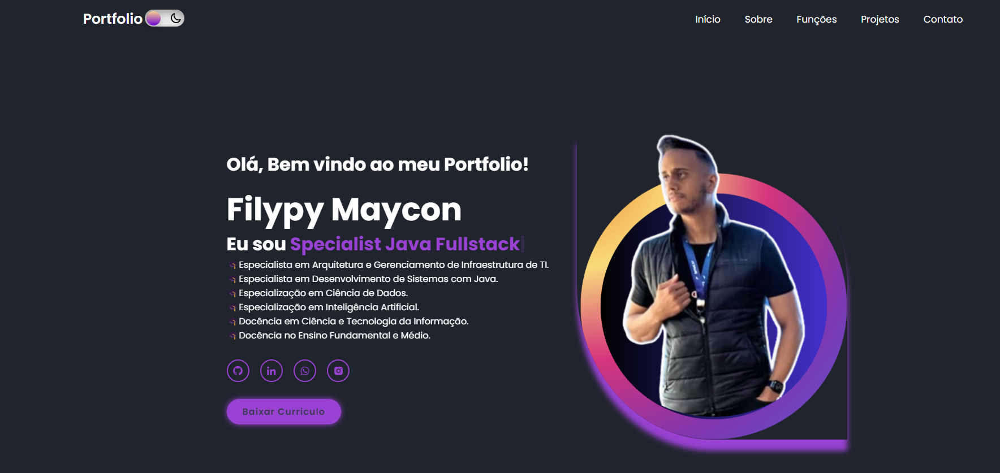

<h1 align="center"></h1>

## :camera: Demo

# Responsive Personal Portfolio Website Using HTML CSS & JavaScript
Aqui tem acesso a alguns projetos implementados um pouco mais sobre o portfolio pessoal

e tambem de como entrar em contato por vários tipos de canais de comunicação.

# Projeto HTML 5 - CSS3 E JAVASCRIPT

  - [x] Responsividade 
  - [x] Tema modo Escuro
  - [x] Scrool moderno
  - [x] Geolocalização
  - [x] Página totalmente funcional

## Deploy on Vercel

[Click aqui](https://portfolio-filypy-maycon.vercel.app/) para ver a live preview deste projeto.

## Aponte a sua camera aqui

  
  

